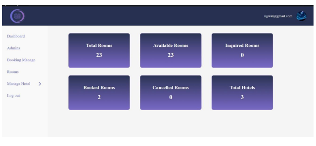

# 🏨 Hotel Booking System

A web-based Hotel Booking System that allows users to browse hotels, filter them by location or popularity, and book rooms online. The system provides an easy and user-friendly interface for customers while managing booking information through a MySQL database.

---

## 📌 Features

- 🔍 Browse a list of available hotels
- 📍 Filter hotels by location
- ⭐ View featured hotels
- 🔥 Explore popular hotels
- 🛏️ Book hotel rooms online
- 👤 User-friendly booking interface
- 💾 Store booking information securely in MySQL
- 📱 Responsive and easy-to-use interface

---

## 🛠️ Tech Stack

### Frontend
- HTML5
- CSS3
- JavaScript

### Backend
- PHP

### Database
- MySQL

---

## 📂 Project Structure

```
Hotel-Booking-System/
│── css/
│── js/
│── images/
│── uploads/
│── index.php
│── hotels.php
│── booking.php
│── login.php
│── register.php
│── config.php
└── README.md
```

> *The folder structure may differ depending on your project.*

---

## 📸 Screenshots

### Booking Page


### Admin Dashboard Page



Example:

```
screenshots/
├── bookingform.png
└── admindashboard.png
```

---

## ⚙️ Installation

1. Clone the repository

```bash
git clone https://github.com/yourusername/hotel-booking-system.git
```

2. Move the project to your local server directory.

- XAMPP → `htdocs`
- WAMP → `www`

3. Start:

- Apache
- MySQL

4. Import the database.

- Open **phpMyAdmin**
- Create a new database
- Import the provided `.sql` file

5. Update the database configuration if necessary.

```php
$host = "localhost";
$user = "root";
$password = "";
$database = "hotel_booking";
```

6. Open your browser.

```
http://localhost/hotel-booking-system
```

---

## 💡 Future Enhancements

- Hotel reviews and ratings
- Email booking confirmation
- Search by price range
- Wishlist functionality

---

## 👨‍💻 Author

**Anusha Shrestha**

GitHub: https://github.com/lazyanusha

---

## 📄 License

This project is intended for educational and learning purposes.
